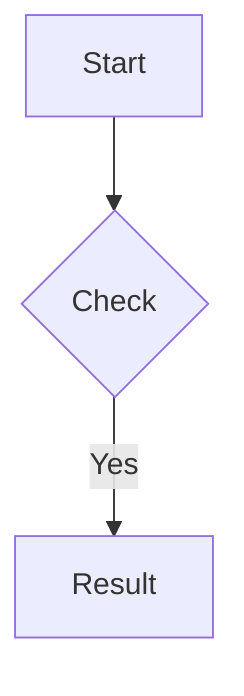

# SDD Technical Plan: plan.md

This is the **technical blueprint** for the implementation.

---

## 1. Architecture Overview
*High-level description of the technical approach.*

## 2. Technical Design
### Data Models / Schemas
- `EntityName`: [Fields and Types]

### API / Interface Contracts
- `Endpoint`: [Input/Output]

### Logic Flow (Mermaid)

## 3. Implementation Strategy
- **Isolation**: Which modules will be touched?
- **Testing Strategy**: How will we test this (Unit/Int)?
- **Migrations**: Database or config changes needed.

## 4. Status
- **AGREE** - Agree with the implementation plan
- **DISAGREE** - Disagree with the implementation plan
- **MODIFIED** - Modified to agree with the implementation plan
- **NEEDS_REVIEW** - Needs review by the user

---
