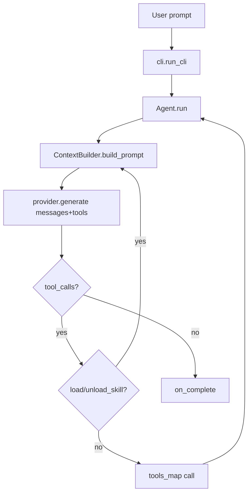

# Architecture & Patterns

> Reality-first map of the system structure. Generated by the SDD Explorer.

## High-Level Structure
```
main.py
  └─> cli.run_cli()                         # argparse + session orchestration
        ├─> ContextBuilder (discover skills/rules)
        ├─> get_provider(...)               # factory → BaseLLMProvider
        ├─> set_active_provider(provider)   # shared with subagents
        ├─> ConsoleAgentListener            # Rich terminal UI
        └─> Agent.run(prompt)               # core ReAct loop
              ├─> preprocess_context_references() # @file/@url/@diff/@staged resolution
              ├─> ContextBuilder.build_prompt()   # dynamic system prompt
              ├─> provider.generate(...)          # LLM call (retry/backoff)
              ├─> tool interception (load_skill/unload_skill/load_mcp/unload_mcp)
              └─> tools_map[tool_name](**args)    # execute real tool (including MCP client tool calls)
```

## Layer Definitions
| Module | Responsibility |
|--------|---------------|
| `main.py` | Thin entry point; delegates to `cli.run_cli()`. |
| `cli.py` | CLI parsing (`argparse`), `ConsoleAgentListener` (Rich UI with verbose toggle), checkpoint detection/resume, provider bootstrap, agent instantiation. |
| `agent.py` | `Agent` ReAct loop; `AgentListener` base class; `SYSTEM_PROMPT`. |
| `context/` | Package managing prompt context: `builder.py` compiles dynamic system prompt (skills/rules); `references.py` parses and resolves prompt `@` references; `breakdown.py` calculates token usage metrics; `mcp.py` manages Model Context Protocol subprocess client lifecycles and dynamic tool mapping. |
| `providers/` | LLM abstraction: `base.py` (`BaseLLMProvider` ABC, Pydantic models, `retry_with_backoff`), `openai.py`, `gemini.py`, `anthropic.py`, `__init__.py` (`get_provider` factory). |
| `tools/` | Agent tools: `io_tools.py` (FS/code ops), `math_tools.py` (`calculate`), `multi_agent.py` (`spawn_subagents_parallel` + `CollectingAgentListener`); `__init__.py` defines `REGISTERED_TOOLS`. |
| `.agents/` | Dynamic context: `skills/` (loadable guidelines), `rules/` (always-active constraints), and `mcp/` (JSON configs for stdio MCP servers). |

## Observed Patterns (with evidence)
1. **Observer / Listener** — `AgentListener` (`agent.py:18`) decouples agent logic from presentation. Implementations: `ConsoleAgentListener` (`cli.py:24`), `CollectingAgentListener` (`tools/multi_agent.py:46`).
2. **Factory** — `get_provider()` (`providers/__init__.py:14`) maps provider name → concrete `BaseLLMProvider`.
3. **Strategy / Abstraction** — `BaseLLMProvider` (`providers/base.py`) defines contract; subclasses implement `_generate()`. Public `generate()` adds retry/backoff.
4. **Registry (single source of truth)** — `tools/__init__.py` defines `REGISTERED_TOOLS` as a list of `(ToolDefinition, handler)` tuples. `TOOLS_METADATA` (Pydantic `ToolDefinition` list, sent to LLM) and `TOOLS_MAP` (name→callable dict, executed by loop) are **derived** from `REGISTERED_TOOLS` at import time. Import-time validation raises `ImportError` on duplicate tool names or non-callable handlers.
5. **Dynamic Context Compilation** — `ContextBuilder.build_prompt()` recompiles the system prompt every loop step, injecting active rules + skill metadata + active skill bodies (`agent.py:91`, `context_builder.py:build_prompt`).
6. **Tool Interception** — `load_skill`/`unload_skill` appear in `REGISTERED_TOOLS` (and thus in `TOOLS_METADATA`/`TOOLS_MAP`) with placeholder lambda handlers, but the `Agent` loop intercepts them *before* dispatching to `TOOLS_MAP` and delegates to `ContextBuilder` (`agent.py:160-176`). The lambda handlers are never actually invoked.
7. **Parallel Orchestration** — `spawn_subagents_parallel` (`tools/multi_agent.py`) uses `ThreadPoolExecutor`; each subagent is a fresh `Agent` reusing the active provider, with `spawn_subagents_parallel` excluded from its toolset to prevent recursion.

## Data Flow (primary request/response)


## Key Invariants
- `REGISTERED_TOOLS` is the single source of truth; `TOOLS_METADATA`/`TOOLS_MAP` are derived from it. Adding a tool requires only one entry (no manual dual-sync). Import-time validation enforces unique names and callable handlers.
- `load_skill`/`unload_skill` are intercepted by the `Agent` loop (delegated to `ContextBuilder`); their `TOOLS_MAP` lambda handlers are never invoked.
- `AgentListener` methods are no-ops by default — safe to omit overrides.
- Provider `_generate()` must return a `ChatMessage` (role ASSISTANT) with optional `tool_calls`.
- System prompt is rebuilt every step; rules active by default, skills loaded on demand.
