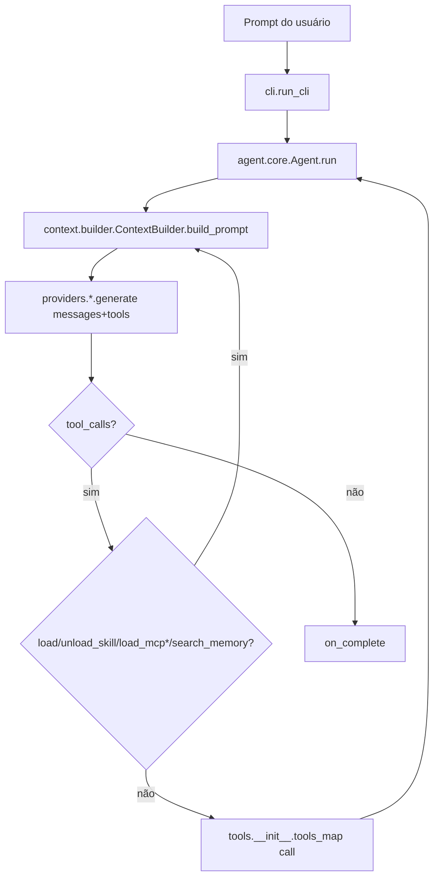

# Arquitetura & Padrões

> Mapa da estrutura real do sistema, baseado no código atual organizado em pacotes. Gerado pelo SDD Explorer.

## Estrutura de Alto Nível
```
main.py
  └─> cli.run_cli()                         # argparse + orquestração de sessão
        ├─> ContextBuilder (descobre skills/rules)
        ├─> get_provider(...)               # factory → BaseLLMProvider
        ├─> set_active_provider(provider)   # compartilhado com subagentes
        ├─> ConsoleAgentListener            # UI de terminal (tui)
        └─> Agent.run(prompt)               # loop ReAct (agent/core.py)
              ├─> preprocess_context_references() # resolução @file/@url/@diff/@staged (context/references.py)
              ├─> ContextBuilder.build_prompt()   # system prompt dinâmico (context/builder.py)
              ├─> provider.generate(...)          # chamada LLM (retry/backoff)
              ├─> interceptação de ferramentas (load_skill/unload_skill/load_mcp*/search_memory em agent/core.py:_execute_tool_call)
              └─> tools_map[tool_name](**args)    # executa ferramenta real (+ ferramentas cliente MCP)
```

## Definições de Camadas
| Pacote / Módulo | Responsabilidade |
|-----------------|------------------|
| `main.py` | Ponto de entrada enxuto; delega para `cli.run_cli()`. |
| `cli.py` | CLI `argparse` (11 flags longas, sem `--verbose`), wiring do `ConsoleAgentListener`, detecção/retomada de checkpoint, bootstrap do provider, instanciação do agente, inicialização do front server. |
| `agent/` | Pacote do agente: `core.py` (loop ReAct do `Agent`, checkpoint de handover no penúltimo passo, execução concorrente de ferramentas via `ThreadPoolExecutor`, disparo de hooks), `prompts.py` (`SYSTEM_PROMPT`, `ORCHESTRATOR_SYSTEM_PROMPT`), `listener.py` (`AgentListener` — classe base plana, métodos no-op, **NÃO** é ABC). |
| `context/` | Pacote de contexto de prompt: `builder.py` compila o system prompt dinâmico (skills/rules/AGENTS.md/DESIGN.md); `references.py` parseia/resolve `@file`/`@url`/`@diff`/`@staged` (`@folder`/`@git` parseados mas não expandidos); `breakdown.py` estima tokens (`calculate_context_breakdown`); `mcp.py` (`MCPManager`: ciclo de vida de subprocesso stdio, mapeamento dinâmico de ferramentas, event loop persistente em background). |
| `providers/` | Abstração de LLM: `base.py` (`BaseLLMProvider` ABC, modelos pydantic `MessageRole`/`ToolCall`/`ChatMessage`/`ToolDefinition`, `retry_with_backoff`), `openai.py` (`OpenAIProvider`/`OpenAICompatibleProvider`/`OpenRouterProvider`), `gemini.py` (`GeminiProvider`), `anthropic.py` (`AnthropicProvider`), `__init__.py` (factory `get_provider`). |
| `tools/` | Ferramentas do agente: `io_tools.py` (`list_project_files`, `read_file`, `write_file`, `patch_file`, `search_grep`, `get_outline`, `delete_file`, `execute_command`), `math_tools.py` (`calculate`), `web_tools.py` (`curl`), `multi_agent.py` (`spawn_subagents_parallel` + `spawn_subagent_async` + `check_subagents_status` + `interrupt_subagent` + `CollectingAgentListener` + `BackgroundSubagentRegistry`), `__init__.py` (`REGISTERED_TOOLS` fonte única de verdade → `TOOLS_METADATA` + `TOOLS_MAP`; `get_orchestrator_tools`/`get_classic_tools`; validação em tempo de import: nome duplicado→`ImportError`, handler não-callable→`ImportError`). |
| `memory/` | Pacote de memória: `core.py` (`AgentMemory` SQLite FTS5, métodos `create_session`/`add_episode`/`update_session_results`/`save_file_outline`/`search`/`close`, `RLock` em nível de classe, rollback em erro, filtro `allowed_categories`), `schema.py` (DDL + `initialize_schema`, FTS5 com fallback FTS4, WAL). |
| `hooks/` | `manager.py` (`HooksManager` carrega módulos `*.py` por evento do pacote `.agents/hooks` + paths do workspace; 11 triggers: `on_session_start`, `on_session_complete`, `on_session_clear`, `pre_step`, `post_step`, `pre_tool_call`, `post_tool_call`, `on_tool_error`, `pre_api_request`, `post_api_request`, `on_error`). |
| `tui/` | `commands.py` (`handle_slash_command`), `helpers.py` (`print_welcome_banner`), `listener.py` (`ConsoleAgentListener` subclasse de `AgentListener`), `runner.py` (`run_one_shot`, `run_interactive_loop`). |
| `front/` | `server.py` (HTTP server da stdlib, `/api/memory.jsonl`), `index.html` (grafo vis-network). |
| `.agents/` | Contexto dinâmico: `skills/` (guias carregáveis), `rules/` (restrições sempre ativas), `mcp/` (configs JSON para servidores MCP stdio drawio + playwright, USADOS pelo `MCPManager`). |

## Padrões Observados (com evidência)
1. **Observer / Listener** — `AgentListener` (`agent/listener.py`) desacopla lógica de apresentação. Implementações: `ConsoleAgentListener` (`tui/listener.py`), `CollectingAgentListener` (`tools/multi_agent.py`).
2. **Factory** — `get_provider()` (`providers/__init__.py`) mapeia nome de provider → `BaseLLMProvider` concreto.
3. **Strategy / Abstraction** — `BaseLLMProvider` (`providers/base.py`) define o contrato; subclasses implementam `_generate()`. O público `generate()` adiciona retry/backoff.
4. **Registry (fonte única de verdade)** — `REGISTERED_TOOLS` (`tools/__init__.py`) é a fonte única; `TOOLS_METADATA`/`TOOLS_MAP` são **derivados** em tempo de import. Validação em tempo de import levanta `ImportError` em nome duplicado ou handler não-callable.
5. **Dynamic Context Compilation** — `ContextBuilder.build_prompt()` (`context/builder.py`) recompila o system prompt a cada passo do loop.
6. **Tool Interception** — `load_skill`/`unload_skill`/`load_mcp*`/`search_memory` são interceptados em `Agent._execute_tool_call` (`agent/core.py`) antes do dispatch para `TOOLS_MAP`; os handlers lambda nunca são invocados.
7. **Parallel Orchestration** — `spawn_subagents_parallel` (`tools/multi_agent.py`) usa `ThreadPoolExecutor`; subagentes reutilizam o provider ativo; `spawn_subagents_parallel` é excluído do toolset para evitar recursão. Também assíncrono: `spawn_subagent_async` roda em thread de background.
8. **Hooks** — `HooksManager` (`hooks/manager.py`) dispara 11 eventos ao longo do loop.

## Fluxo de Dados (requisição/resposta primária)


## Invariantes Chave
- `REGISTERED_TOOLS` é a fonte única de verdade; `TOOLS_METADATA`/`TOOLS_MAP` são derivados dela. Adicionar uma ferramenta exige apenas uma entrada (sem dual-sync manual). A validação em tempo de import reforça nomes únicos e handlers callable.
- `load_skill`/`unload_skill` são interceptados pelo loop do `Agent` (em `agent/core.py:_execute_tool_call`); seus handlers lambda em `TOOLS_MAP` nunca são invocados.
- Os métodos de `AgentListener` são no-op por padrão — seguro omitir overrides.
- O `_generate()` do provider deve retornar um `ChatMessage` (role ASSISTANT) com `tool_calls` opcional.
- O system prompt é reconstruído a cada passo; o modo orquestrador filtra para 11 ferramentas (`ORCHESTRATOR_TOOL_NAMES`).
