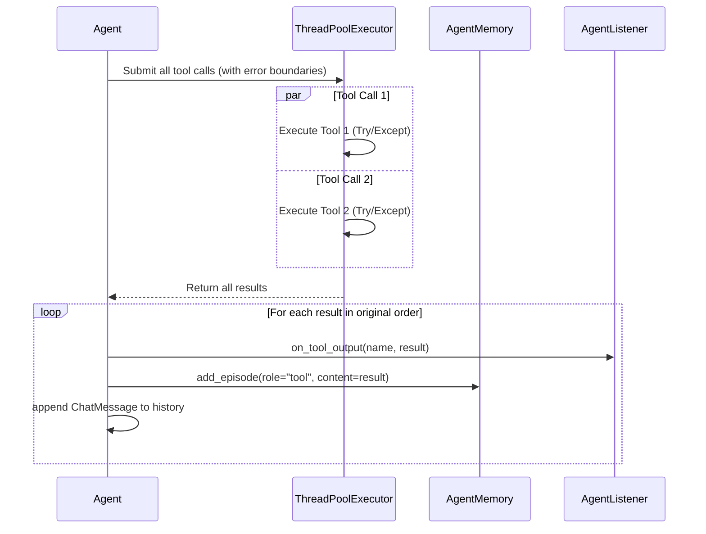

# SDD Technical Plan: concurrent_tool_execution

This is the technical blueprint for the concurrent tool execution implementation.

---

## 1. Architecture Overview
Instead of executing tool calls sequentially in a blocking `for` loop in the main agent thread, the ReAct loop will dispatch independent tool calls concurrently to a `ThreadPoolExecutor`. Once all tool calls complete, the main thread will sequentially handle logging, events, and history appending to preserve consistency and order.

## 2. Technical Design

### Tool Execution Safety & Context Preservation
To ensure tool crashes do not kill the agent process prematurely, each tool execution inside the pool will run inside a try-except block. Any exceptions will be converted to a structured error string, mimicking the exact behavior of the synchronous loop.

Additionally, to ensure context sequence is identical to the sequential version and no history is corrupted or duplicated:
1. Tool calls will be dispatched in their original order.
2. The results will be collected and mapped back to their original request position.
3. Appending to `self.history`, calling listeners, and logging to `self.memory` will occur sequentially in the main thread in the exact order requested by the LLM.

### Event Loop Concurrency Flow

### Database Synchronization
To prevent multi-threading SQLite transaction conflicts when tools like `search_memory` are executed concurrently, we will add a reentrant lock `self.lock = threading.RLock()` in [memory.py](file:///home/klebersonromero/Projetos/teste/memory.py)'s `AgentMemory` class. Every database method will be wrapped in `with self.lock:`.

---

## 3. Implementation Strategy
- **Isolation**:
  - Touch [agent.py](file:///home/klebersonromero/Projetos/teste/agent.py) to update the tool execution loop.
  - Touch [memory.py](file:///home/klebersonromero/Projetos/teste/memory.py) to add locking to database transactions.
- **Testing Strategy**:
  - Add [tests/test_concurrent_tool_execution.py](file:///home/klebersonromero/Projetos/teste/tests/test_concurrent_tool_execution.py).
  - Create two mock tools with `time.sleep(1.0)`. Run them concurrently through a mock provider. Assert total execution time is < 1.5 seconds.
  - Create a failing mock tool to verify that it does not crash the agent process and returns the proper error string.
  - Assert that tool results are logged in the correct order in history.
- **Migrations**: No database schema migrations required (only locking logic).

---

## 4. Status
- **AGREE**
