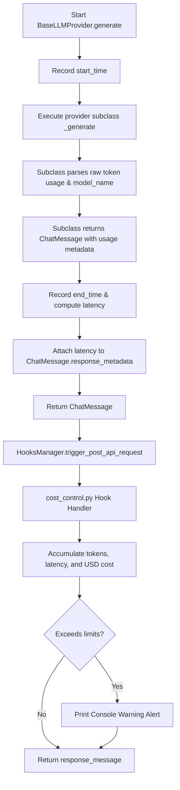

# SDD Technical Plan: plan.md

This is the **technical blueprint** for implementing the cost control hook.

---

## 1. Architecture Overview
We will add `response_metadata` to the standardized `ChatMessage` class. Then, we will measure latency and extract token usage from the raw responses in each of the three major providers (`OpenAIProvider`, `GeminiProvider`, `AnthropicProvider`) and store this information inside `ChatMessage.response_metadata`.
Finally, we will create the hook handler `cost_control.py` inside `.agents/hooks/post_api_request/` which will accumulate the values in global variables (since the session runs in a single process) and trigger warning alerts to `sys.stderr` if they exceed the user-defined limits.

## 2. Technical Design

### Data Models / Schemas
- `ChatMessage`: Extend with field `response_metadata: Optional[Dict[str, Any]] = None` containing:
  - `prompt_tokens`: `int`
  - `completion_tokens`: `int`
  - `total_tokens`: `int`
  - `latency`: `float` (in seconds)
  - `model_name`: `str`

### Logic Flow (Mermaid)

## 3. Implementation Strategy
- **Isolation**:
  - `providers/base.py`: Modify `ChatMessage` model definition. In `BaseLLMProvider.generate`, measure latency and set it in `response_metadata`.
  - `providers/openai.py`: Populate `response_metadata` with token usage and `model_name` from the OpenAI completions response.
  - `providers/gemini.py`: Populate `response_metadata` with token usage and `model_name` from the Gemini generate content response.
  - `providers/anthropic.py`: Populate `response_metadata` with token usage and `model_name` from the Anthropic messages response.
  - `.agents/hooks/post_api_request/cost_control.py`: Create the hook that tracks usage and alerts if limits are exceeded.
- **Testing Strategy**:
  - Create a unit test `tests/test_cost_control.py` that verifies:
    - Metadata extraction under mock provider responses.
    - Accumulated cost calculation and pricing logic.
    - Warning threshold alerts.
- **Migrations**:
  - No database migration is needed. The SQLite memory database does not require changes because `ChatMessage` is not persisted in a strict schema that prevents addition of `response_metadata`.

## 4. Status
- **AGREE** - Agree with the implementation plan
