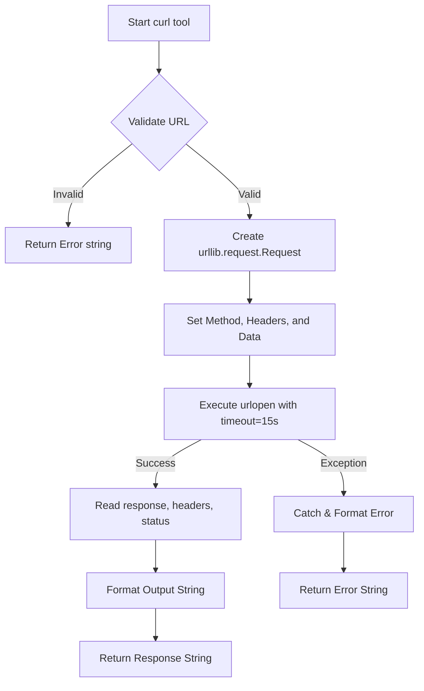

# SDD Technical Plan: plan.md

This is the technical blueprint for the `curl` tool implementation.

---

## 1. Architecture Overview
We will implement the `curl` tool in a new file `tools/web_tools.py` and register it in the unified tool registry `tools/__init__.py`. The tool will use `urllib.request` from the standard library to make HTTP requests, retrieve status codes, response headers, and the response body.

## 2. Technical Design

### API / Interface Contracts
- **Tool Name**: `curl`
- **Arguments**:
  - `url` (str, required): The target HTTP/HTTPS URL.
  - `method` (str, optional): The HTTP method (GET, POST, PUT, DELETE, PATCH, etc.). Defaults to `"GET"`.
  - `headers` (dict[str, str], optional): Dictionary of HTTP headers. Defaults to `None`.
  - `data` (str, optional): The raw request payload body. Defaults to `None`.
  - `verify_ssl` (bool, optional): If False, ignores SSL certificate errors (like `curl -k`). Defaults to `True`.
  - `timeout` (int, optional): Timeout in seconds for the request. Defaults to `15`.
  - `max_response_chars` (int, optional): Maximum number of characters in the response body to return (to avoid context bloating). Defaults to `50000`.

- **Output Format**:
  A formatted string of the form:
  ```
  Status: <status_code> <reason>
  Headers:
    <Header-Name>: <Header-Value>
    ...
  Body:
  <response_body_text>
  ```
  In case of error, returns:
  ```
  Error: <error_details>
  ```

### Logic Flow (Mermaid)


## 3. Implementation Strategy
- **Isolation**: 
  - Create a new file `tools/web_tools.py`.
  - Modify `tools/__init__.py` to import and register the tool.
  - Create a new test file `tests/test_curl_tool.py` to assert functionality.
- **Testing Strategy**:
  - Implement unit tests using standard library `unittest.mock` to mock `urllib.request.urlopen`.
  - Test GET requests, POST requests with custom headers and data, and error handling (HTTPError, URLError, TimeoutError).
- **Migrations**: No migrations or external dependencies needed.

## 4. Status
- **AGREE**
