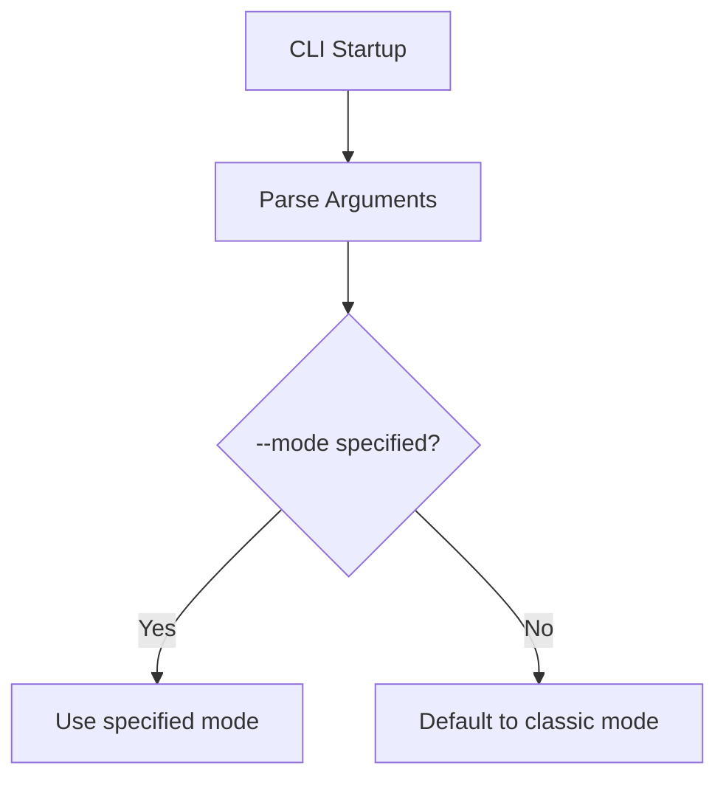

# SDD Technical Plan: plan.md

Technical plan to update the default execution mode in `cli.py`.

---

## 1. Architecture Overview
We will surgically modify the argument parsing configuration in `cli.py`. Changing the default value of the `--mode` parameter will alter the CLI setup without impacting the core ReAct loop or the agent implementation.

## 2. Technical Design

### Code Modification
In [cli.py](file:///home/klebersonromero/Projetos/teste/cli.py):
- Locate the `--mode` argument definition.
- Replace `default="orchestrator"` with `default="classic"`.

### Logic Flow (Mermaid)

## 3. Implementation Strategy
- **Isolation**: Only `cli.py` is modified.
- **Testing Strategy**: Run the pytest suite (especially `test_agent_orchestrator.py` and `test_cli_loop.py`). Run the CLI with `--help` and capture output.

---

## 4. Status
- **AGREE** - Agree with the implementation plan
