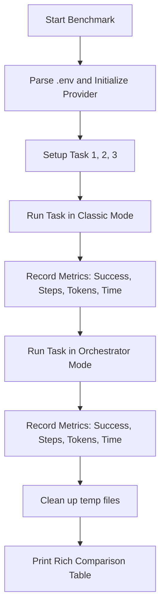

# SDD Technical Plan: plan.md

Technical plan to implement a capability comparison benchmark between Classic and Orchestrator modes.

---

## 1. Architecture Overview
We will create a standalone script `scripts/benchmark_modes.py` that imports the core classes from `agent/core.py` and `providers/__init__.py`. 
By using the real AI provider configured in `.env`, the script will run both modes side-by-side on three different tasks.

## 2. Technical Design

### Verification Logic Flow


### Interface & Execution Contract
The script `scripts/benchmark_modes.py` will be executable from the command line:
```bash
python3 scripts/benchmark_modes.py
```
It will output progress logs in real-time, followed by a summary table highlighting the differences in:
- Step count.
- Tokens used.
- Execution time.
- Task completion success.

## 3. Implementation Strategy
- **Isolation**: Only `scripts/benchmark_modes.py` is added. No modification to the core agent logic is required.
- **Cleanup**: The script will automatically delete any file created during execution (`temp_benchmark_*`).
- **Dependencies**: The script will use `rich` for formatting, standard library modules, and our internal `agent` and `providers` packages.

---

## 4. Status
- **AGREE** - Agree with the implementation plan
