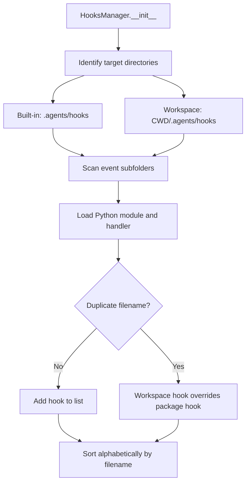

# SDD Technical Plan: hooks_system (plan.md)

Technical design and blueprint for implementing the dynamic Hooks module.

---

## 1. Architecture Overview
We will implement a `HooksManager` class that dynamically loads hooks from two directories:
1. Built-in package hooks location (`.agents/hooks/` in the project root directory).
2. Local workspace hooks location (`.agents/hooks/` in the current working directory).

Conflict resolution:
- If a hook script filename is present in both directories, the workspace hook will overwrite the built-in package hook.
- All loaded hooks for an event are executed sequentially, sorted alphabetically by their filename.

## 2. Technical Design

### Directory Structure
We will create a new package directory `hooks/` at the project root with the following layout:
```
hooks/
  ├── __init__.py
  └── manager.py
```

We will also initialize/support the `.agents/hooks/` directory with subdirectories for each hook event category:
- `on_session_start`
- `on_session_complete`
- `on_session_clear`
- `pre_step`
- `post_step`
- `pre_tool_call`
- `post_tool_call`
- `on_tool_error`
- `pre_api_request`
- `post_api_request`
- `on_error`

### API / Interface Contracts
Each hook event subdirectory contains Python files. Each file must define a function named `handler`.
The signature of `handler` varies by event:
- `on_session_start(agent)`
- `on_session_complete(agent)`
- `on_session_clear(agent)`
- `pre_step(agent, step)`
- `post_step(agent, step)`
- `pre_tool_call(name, arguments) -> Optional[Tuple[str, dict]]`
- `post_tool_call(name, arguments, result) -> Optional[str]`
- `on_tool_error(name, arguments, exception) -> Optional[str]`
- `pre_api_request(messages, tools) -> Optional[Tuple[list, list]]`
- `post_api_request(response_message) -> Optional[ChatMessage]`
- `on_error(agent, error_message)`

### Logic Flow (Mermaid)


## 3. Implementation Strategy
- **Isolation**:
  - Implement `hooks/manager.py` and `hooks/__init__.py`.
  - Modify `agent.py` to instantiate and trigger hooks in the appropriate places of the ReAct loop.
  - Modify `cli.py` to trigger the `on_session_clear` hook.
- **Testing Strategy**:
  - Add unit tests in `tests/test_hooks.py` verifying dynamic loading, execution, overriding, and fail-safe handling of all 11 hook triggers.
  - Run `uv run pytest tests/test_hooks.py` to verify correctness.

## 4. Status
- **MODIFIED** - Aligned with the required implementation patterns.
