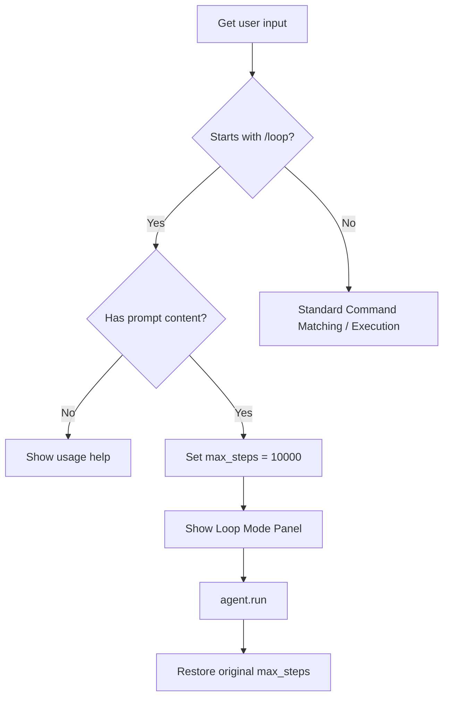

# SDD Technical Plan: plan.md

This is the technical blueprint for the `/loop` command implementation.

---

## 1. Architecture Overview
We will implement the `/loop` command handling logic within `cli.py`. We will intercept the `/loop` command from both the command line arguments (`--prompt "/loop ..."`) and the interactive session input loop.

## 2. Technical Design

### API / Interface Contracts
- **Interactive Command**: `/loop <prompt>`
- **Behavior**:
  1. Strips `/loop ` from the user prompt.
  2. Sets `agent.max_steps` to `10000` temporarily.
  3. Displays a red status panel indicating "Loop Mode".
  4. Runs the agent via `agent.run(prompt)`.
  5. Restores `agent.max_steps` to the original value.

### Logic Flow (Mermaid)

## 3. Implementation Strategy
- **Isolation**:
  - All changes will be isolated to `cli.py` to handle prompt parsing and agent execution wrapper logic.
- **Testing Strategy**:
  - We will implement unit tests verifying the parsing of `/loop` commands in `tests/test_cli_commands.py` or by adding them to `tests/test_agent.py`.
  - Let's check `tests/test_agent.py` to see if there is CLI tests or create a new test file `tests/test_cli_loop.py`.

## 4. Status
- **AGREE**
