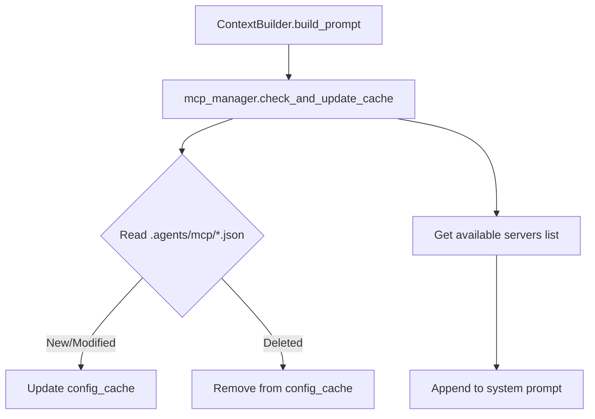

# SDD Technical Plan: mcp_cache_and_fixes (plan.md)

This plan defines the architectural overview and technical implementation details for securing path checks, caching MCP configurations, and cleaning up pytest warnings.

---

## 1. Architecture Overview

### Path Traversal Guard Fix
Replace the startswith check in `tools/io_tools.py` with `os.path.commonpath`.
`os.path.commonpath([cwd, abs_path])` must return `cwd` exactly. This guarantees that `abs_path` is nested under `cwd` and prevents sibling directory bypasses.

### Pytest Warning Resolution
In `tests/test_mcp_client.py`, the `mock_run_sync(coro)` helper will inspect the input `coro`. If it is a coroutine object (e.g. from the mock's `__aenter__` / `__aexit__`), it will be closed via `coro.close()` to prevent the `RuntimeWarning` from being emitted.

### MCP Config Caching & Lifecycle
1. **Directory Discovery**: `MCPManager` will discover config directories:
   - Builtin package `.agents/mcp/`
   - CWD `.agents/mcp/`
2. **Pre-caching**:
   - `self.config_cache: Dict[str, Dict[str, Any]]` will store `{"mtime": float, "config": dict, "path": str}`.
   - On init, `MCPManager` will scan directories and load config JSONs.
3. **Dynamic Invalidation**:
   - `self.check_and_update_cache()` will scan directories.
   - For each file:
     - If it is new, load it into cache.
     - If it is modified (current `mtime` != cached `mtime`), reload it.
     - Keep track of visited files; if a cached server's config file no longer exists, remove it from the cache.
   - If an active server's config is modified or deleted, we should also log a warning (or let `load_mcp` handle the reload).
4. **System Prompt Integration**:
   - `ContextBuilder.build_prompt()` will fetch available MCP servers from `self.mcp_manager` and append them to the system prompt, so the agent knows what servers can be loaded.

---

## 2. Technical Design

### Flow Diagram

---

## 3. Implementation Strategy

- **Touched Files**:
  - `tools/io_tools.py` (Path traversal guard in all FS tools)
  - `context/mcp.py` (`MCPManager` discovery, caching, check/update)
  - `context/builder.py` (`ContextBuilder` prompt integration)
  - `agent.py` (`Agent.__init__` links `mcp_manager` to `context_builder`)
  - `tests/test_mcp_client.py` (Mock runner fix)
  - `tests/test_memory_graph.py` & others (Verify no regressions)

- **Testing Strategy**:
  - Add unit tests verifying `check_and_update_cache` behavior (detecting addition, modification, deletion of config files).
  - Add unit tests verifying path traversal checks for sibling directories.

---

## 4. Status
- **NEEDS_REVIEW**
