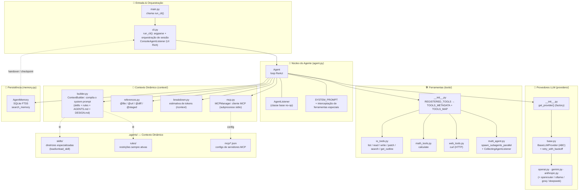

# Agnostic AI Agent Loop

Um framework de agente de IA **autônomo e agnóstico a provedores**, capaz de executar agentes que raciocinam passo a passo e utilizam ferramentas para interagir com o sistema de arquivos, realizar cálculos, **orquestrar subagentes em paralelo**, **plugar ferramentas externas via Model Context Protocol (MCP)**, **injetar contexto de arquivos/URLs/diffs no prompt** e **persistir memória de sessões em SQLite**. Suporta múltiplos provedores de LLM (OpenAI, Gemini, Anthropic, OpenRouter, Ollama, Groq, DeepSeek etc.) através de uma única interface unificada.

> 💡 O projeto já vem configurado no `.env.example` para usar o **OpenRouter** com o modelo `anthropic/claude-3.5-sonnet`, mas qualquer provedor suportado pode ser utilizado via linha de comando ou variáveis de ambiente.

## 🎯 Visão Geral

Este projeto implementa um **loop de agente autônomo** que:

- **Raciocina passo a passo** antes de tomar ações (e explica o seu raciocínio).
- **Utiliza ferramentas** para listar/ler/escrever arquivos, editar por bloco, buscar conteúdo, inspecionar a estrutura de código, calcular expressões matemáticas e **executar requisições HTTP** (estilo `curl` via `urllib`).
- **Executa múltiplas chamadas de ferramenta em paralelo** (via `ThreadPoolExecutor`) para otimizar a latência, com isolamento e tratamento de exceções por thread.
- **Carrega e descarrega dinamicamente *skills* e *rules*** para compor o *system prompt* de forma otimizada (via `ContextBuilder`), mantendo a janela de contexto enxuta — e também injeta dinamicamente o `AGENTS.md` e (quando relevante) o `DESIGN.md` do diretório de trabalho.
- **Orquestra subagentes em paralelo** (`spawn_subagents_parallel`) para dividir tarefas grandes em partes menores executadas simultaneamente.
- **Pluga ferramentas externas via MCP** (`load_mcp` / `load_mcp_tool`) — servidores Model Context Protocol são lançados como subprocessos e suas ferramentas são expostas ao agente em tempo de execução, sob demanda, para não estourar o orçamento de contexto.
- **Injeta referências de contexto no prompt** (`@file`, `@url`, `@diff`, `@staged`) — o agente "enxerga" o conteúdo de arquivos, páginas web e diffs de git diretamente na sua tarefa.
- **Persiste memória de sessões** em um banco SQLite com índice FTS5 (`AgentMemory`) e a recupera semanticamente via a ferramenta `search_memory`.
- **Suporta múltiplos provedores de LLM** por meio de uma camada de abstração unificada (`BaseLLMProvider` + factory `get_provider`).
- **É executado localmente**, com controle total sobre o ambiente de execução.
- Possui uma **interface de observação** (`AgentListener`) que desacopla a lógica do agente da apresentação (terminal, web, GUI etc.).
- Expõe um **comando de inspeção de contexto** (`/context`) que calcula e exibe, em uma tabela colorida, a estimativa de uso de tokens da janela de contexto.

## 🏗️ Arquitetura

O projeto é organizado em módulos, cada um com uma responsabilidade bem definida:



### Componentes Principais

| Arquivo / Pacote | Descrição |
|---------|-----------|
| `main.py` | Ponto de entrada; apenas invoca `run_cli()` de `cli.py` |
| `cli.py` | Parsing de argumentos de linha de comando (via `argparse`), `ConsoleAgentListener` (saída colorida), comandos de modo interativo (`/context`, `/verbose`, `/clear`, `/exit`), detecção/retomada de *checkpoint* e orquestração da sessão |
| `agent.py` | Loop principal do agente (`Agent`), classe base `AgentListener` (métodos no-op, não uma ABC), o `SYSTEM_PROMPT` e a interceptação de ferramentas especiais (`load_skill`/`unload_skill`, `load_mcp`/`unload_mcp`/`load_mcp_tool`/`unload_mcp_tool`, `search_memory`) |
| `context/` | Pacote de contexto dinâmico do prompt: `builder.py` (compila o *system prompt* com skills/rules/AGENTS.md/DESIGN.md), `references.py` (resolve referências `@file`/`@url`/`@diff`/`@staged` no prompt do usuário), `breakdown.py` (calcula a estimativa de uso de tokens da janela de contexto) e `mcp.py` (`MCPManager` — cliente MCP via subprocesso stdio) |
| `providers/` | Pacote de abstração dos provedores de LLM: `base.py` (classe abstrata `BaseLLMProvider` + modelos Pydantic + `retry_with_backoff`) e implementações (`openai.py`, `gemini.py`, `anthropic.py`); a factory `get_provider()` fica em `providers/__init__.py` |
| `tools/` | Pacote de ferramentas do agente, dividido em módulos: `io_tools.py` (ops. de arquivo/código), `math_tools.py` (cálculo), `web_tools.py` (requisições HTTP `curl`), `multi_agent.py` (orquestração de subagentes) e `__init__.py` (registro único `REGISTERED_TOOLS`, de onde derivam `TOOLS_METADATA` e `TOOLS_MAP`, além de `set_active_provider`) |
| `memory.py` | `AgentMemory` — banco SQLite local com índice FTS5 que persiste e permite busca semântica do histórico de sessões, pensamentos, ferramentas e *handovers* |
| `.agents/` | Diretório de **contexto dinâmico**: `skills/` (diretrizes especializadas carregáveis), `rules/` (restrições estruturais sempre ativas) e `mcp/` (configurações JSON de servidores MCP stdio) |
| `pyproject.toml` | Metadados do projeto e dependências (build via `hatchling`, com *entry-point* `agnostic-agent`) |

## 🚀 Início Rápido

### Pré-requisitos

- Python **3.14+**
- Chave de API de pelo menos um provedor suportado

### Instalação

```bash
# Clone e instale as dependências
git clone <repo-url>
cd <diretorio-do-projeto>

# Usando uv (gerenciador usado pelo projeto, veja uv.lock)
uv sync

# Ou usando pip
pip install -e .
```

### Instalação Global como Ferramenta (`uv` / `pip`)

Você pode compilar e instalar o agente como uma ferramenta de linha de comando global. Graças ao `ContextBuilder` dinâmico e às resoluções de caminho absoluto, a ferramenta funcionará em qualquer diretório da sua máquina, acessando as skills/regras embutidas e operando sobre a pasta onde foi executada.

O projeto declara o *entry-point* `agnostic-agent = "cli:run_cli"` em `[project.scripts]`, então a ferramenta é exposta automaticamente na instalação.

**Usando `uv` (Recomendado):**
```bash
# Instalar a ferramenta globalmente
uv tool install .

# Executar a partir de qualquer pasta
agnostic-agent --prompt "Explique a estrutura deste diretório"
```

**Usando `pip`:**
```bash
# Instalar globalmente no ambiente Python do usuário
pip install .

# Executar a partir de qualquer pasta
agnostic-agent --prompt "Explique a estrutura deste diretório"
```

Para atualizar a ferramenta instalada globalmente após modificar o código:
```bash
# Com uv
uv tool install --force .

# Com pip
pip install --upgrade .
```

### Configuração

Crie um arquivo `.env` com suas chaves de API (o `.env.example` já traz um modelo voltado ao OpenRouter):

```bash
# Copie o exemplo
cp .env.example .env

# Edite com suas chaves
# OPENROUTER_API_KEY=sk-or-...
# GEMINI_API_KEY=...
# OPENAI_API_KEY=sk-...
# ANTHROPIC_API_KEY=...
```

> 💡 Você também pode definir `AGENT_PROVIDER` e `AGENT_MODEL` no `.env` para usar valores padrão sem passar flags na linha de comando.

### Executando o Agente

```bash
# Uso básico (provedor/modelo padrão do código: gemini / gemini-2.5-flash)
python main.py --prompt "Liste todos os arquivos Python do projeto"

# Especificar provedor e modelo
python main.py --provider openai --model gpt-4o-mini --prompt "Crie um script hello world"

# Usar OpenRouter (conforme .env.example)
python main.py --provider openrouter --model anthropic/claude-3.5-sonnet --prompt "Explique este código"

# Usar Ollama local
python main.py --provider ollama --model llama3.2 --base-url http://localhost:11434/v1 --prompt "Explique este código"

# Modo interativo (sem --prompt)
python main.py --provider anthropic --model claude-3-5-sonnet-20241022
```

## 💻 Linha de Comando (CLI)

A interface de linha de comando é construída com a biblioteca padrão **`argparse`** (sem dependências de terceiros como Click/Typer). É um **único comando plano** — não há subcomandos nem argumentos posicionais; todas as opções são *flags* opcionais. Se `--prompt` não for informado, o programa entra em **modo interativo** e solicita a entrada via `input()`.

| Opção | Tipo | Padrão | Override por env var | Descrição |
|-------|------|--------|----------------------|-----------|
| `--provider` | `str` | `gemini` | `AGENT_PROVIDER` | Provedor de LLM: `openai`, `gemini`, `anthropic`, `openrouter`, `openai_compatible` (Ollama/Groq/DeepSeek) |
| `--model` | `str` | `gemini-2.5-flash` | `AGENT_MODEL` | Nome do modelo (ex.: `gemini-2.5-flash`, `gpt-4o-mini`, `claude-3-5-sonnet-20241022`) |
| `--api-key` | `str` | *(nenhum)* | — | Chave de API do provedor (opcional; recorre às variáveis de ambiente) |
| `--base-url` | `str` | *(nenhum)* | — | URL base customizada para endpoints compatíveis com OpenAI (Ollama, Groq, locais) |
| `--prompt` | `str` | *(nenhum)* | — | Tarefa para o agente. Se omitido, inicia o modo interativo |
| `--max-steps` | `int` | `200` | — | Número máximo de iterações/passos do loop do agente |

> ℹ️ O loop principal do agente chama o provedor com `temperature=0.2` (fixo) e `max_steps` definido pela flag `--max-steps` (padrão `200` na CLI; o construtor de `Agent` usa `15` caso nenhum valor seja passado).

### Comandos de Modo Interativo

No modo interativo (sem `--prompt`), além de digitar a tarefa, você pode usar *slash commands*:

| Comando | Aliases | Descrição |
|---------|---------|-----------|
| `/context` | `/c` | Calcula e exibe, em uma tabela colorida Rich, a estimativa de uso de tokens da janela de contexto (prompt base, regras ativas, metadados de skills, corpo de skills ativas, schemas de ferramentas, histórico de conversa e total), em relação a um limite padrão de 128.000 tokens |
| `/verbose` | `/outputs`, `/v` | Alterna a exibição detalhada da saída das ferramentas (panéis com realce de sintaxe) |
| `/clear` | `/reset` | Limpa o histórico de conversa e o contexto ativo (recompila o *system prompt*) |
| `/exit` | `/quit` | Encerra a sessão interativa |
| `/loop` | — | Executa a tarefa com um limite de passos elevado (`max_steps=10000`), removendo preventivamente os limites baixos e os *checkpoints* de handover antecipados, para que o agente rode tarefas longas até a conclusão. Pode ser usado como comando interativo (`/loop <prompt>`) ou como prefixo do `--prompt` (`--prompt "/loop <tarefa>"`) |

### Fluxo de Execução

1. Faz o parsing dos argumentos via `argparse`.
2. Se `--prompt` estiver vazio, imprime um banner de boas-vindas (enumerando skills/rules descobertas) e lê o prompt interativamente do terminal via `console.input()` do Rich (trata `Ctrl+C`/`EOF` com elegância, encerrando).
3. Inicializa o provedor de IA via `get_provider(provider_name, model_name, api_key, base_url)`; em caso de falha, imprime erro e sai.
4. Registra o provedor para as ferramentas via `set_active_provider(provider)` (definido em `tools/multi_agent.py` e reexportado por `tools/__init__.py`).
5. Cria um `ConsoleAgentListener` (saída colorida no terminal) e um `Agent` com as ferramentas disponíveis e `max_steps`.
6. Executa o loop do agente com `agent.run(prompt)`. Antes de cada passo, o prompt do usuário é pré-processado para expandir referências de contexto (`@file`, `@url`, `@diff`, `@staged`); o *system prompt* é recompilado dinamicamente a cada passo.

## 💾 Checkpoint & Retomada de Sessão (Handover)

O agente possui um mecanismo de **checkpoint de handover** que evita a perda de trabalho quando a tarefa não é concluída dentro do limite de passos (`--max-steps`).

Como funciona (`agent.py` + `cli.py`):

1. No **penúltimo passo** (`step == max_steps - 1`, desde que `max_steps > 2`), o agente entra em **modo de emergência**: o sistema envia um aviso instruindo-o a **não chamar ferramentas** e a redigir um *handover checkpoint report* em Markdown (Progress Achieved, Blockers/Delays, Backlog, Next Step). Nesse passo, as ferramentas são desativadas (`tools=None`).
2. O relatório é salvo em **`checkpoint.json`** (na raiz do projeto), junto com o `exit_reason` e o histórico completo da conversa (`history`), desde que `write_checkpoint_file=True` (padrão do `Agent`).
3. Ao iniciar uma nova execução em **modo interativo** (ou seja, sem `--prompt`), se existir um `checkpoint.json`, o `cli.py` o detecta e exibe o relatório, perguntando se você deseja **retomar a tarefa** (`y/n`, padrão `y`). Ao retomar, o agente recebe o relatório de handover como contexto e continua a partir dos próximos passos imediatos. (Caso um `--prompt` seja informado, a detecção de checkpoint é ignorada e a tarefa recomeça do zero.)
4. Se a tarefa for concluída com sucesso (`exit_reason != "MAX_STEPS_REACHED"`), o `cli.py` **remove automaticamente** o `checkpoint.json`. Se você recusar a retomada, o arquivo é renomeado para `checkpoint.json.old` para evitar conflito.

> 🔒 O `checkpoint.json` contém o histórico completo da conversa e já está listado no `.gitignore` — nunca deve ser commitado.

## 🧩 Sistema de Contexto Dinâmico (Skills & Rules)

O *system prompt* do agente **não é estático**. Ele é compilado a cada passo do loop pelo `ContextBuilder` (`context/builder.py`), que combina:

1. O **prompt base** do agente (`SYSTEM_PROMPT` em `agent.py`).
2. O **`AGENTS.md`** do diretório de trabalho (re-lido quando o arquivo muda, via cache de *mtime*).
3. O **`DESIGN.md`** do diretório de trabalho — **somente** quando o histórico contém palavras-chave de design/frontend (ex.: `design`, `frontend`, `ui`, `css`, `react`, `tailwind`), para economizar contexto.
4. Um bloco fixo de **"Memory & Source of Truth Constraints"** (orienta o modelo sobre o índice de memória SQLite FTS5 e que os arquivos físicos são a fonte da verdade).
5. As **regras ativas** (`.agents/rules/*.md`) — restrições estruturais sempre injetadas no prompt.
6. Os **metadados das skills disponíveis** (`.agents/skills/*/SKILL.md`) — apenas nome, descrição e palavras-chave.
7. O **corpo detalhado das skills ativas** — carregado sob demanda.

### Como funciona

- **Regras (`.agents/rules/`)** são arquivos Markdown que descrevem restrições/comportamentos obrigatórios. São **ativadas por padrão** na inicialização e sempre incluídas no prompt. Podem ser ligadas/desligadas em tempo de execução via `load_rule`/`unload_rule` (métodos do `ContextBuilder`).
- **Skills (`.agents/skills/<nome>/SKILL.md`)** são diretrizes especializadas (ex.: `debug`, `refactor`, `search`). Cada `SKILL.md` possui um *frontmatter* YAML com `name`, `description` e `keywords`. Apenas os **metadados** são carregados no início; o **corpo completo** só é injetado quando o agente chama a ferramenta `load_skill(name)`, e removido com `unload_skill(name)` para liberar espaço na janela de contexto.

### Ferramentas de contexto

O agente controla esse sistema através das ferramentas `load_skill` e `unload_skill` (veja a tabela de ferramentas abaixo). Quando o modelo as invoca, o `Agent` intercepta a chamada e atualiza o `ContextBuilder` em tempo real; no passo seguinte, o *system prompt* é recompilado refletindo as skills ativas.

### Skills disponíveis no projeto

| Skill | Diretório | Propósito |
|-------|-----------|-----------|
| `debug` | `.agents/skills/debug` | Analisa erros, encontra causas raízes e sugere correções |
| `refactor` | `.agents/skills/refactor` | Melhora estrutura, padrões e arquitetura de código |
| `search` | `.agents/skills/search` | Busca informações no codebase, docs ou fontes externas |
| `sdd-planner` | `.agents/skills/sdd-planner` | Planejamento de projeto, visão e roadmap (Spec Driven Development) |
| `sdd-explorer` | `.agents/skills/sdd-explorer` | Mapeia codebases existentes em artefatos técnicos consolidados |
| `sdd-executor` | `.agents/skills/sdd-executor` | Implementação cirúrgica seguindo protocolos de qualidade |
| `sdd-review` | `.agents/skills/sdd-review` | Valida implementação contra critérios de aceitação |

> 📌 Cada skill pode conter uma pasta `references/` com documentos complementares (templates, guias) que são carregados junto com o corpo da skill. **Observação:** no projeto atual, apenas as skills `sdd-*` (`sdd-planner`, `sdd-explorer`, `sdd-executor`, `sdd-review`) possuem pasta `references/`; as skills `debug`, `refactor` e `search` contêm apenas o `SKILL.md`.

## 📎 Referências de Contexto no Prompt (`@file`, `@url`, `@diff`, `@staged`)

O agente expande **referências de contexto** embutidas no prompt do usuário antes de cada execução (`context/references.py`). Isso permite que você "aponte" para arquivos, URLs e diffs de git diretamente na tarefa, e o conteúdo é injetado inline no lugar da referência.

### Sintaxe

| Referência | Exemplo | O que faz |
|------------|---------|-----------|
| `@file:<caminho>` | `@file:"src/app.py"` ou `@file:main.py:10-25` | Insere o conteúdo do arquivo (opcionalmente um intervalo de linhas 1-indexed, inclusivo). Caminhos com espaços devem estar entre aspas |
| `@url:<url>` | `@url:https://example.com/docs` | Busca a página (HTTP/HTTPS), remove `<script>`/`<style>`, trunca em 40.000 caracteres e insere o texto |
| `@diff` | `@diff` | Insere a saída de `git diff` (alterações não estagiadas) |
| `@staged` | `@staged` | Insere a saída de `git diff --staged` (alterações estagiadas) |
| `@folder:<caminho>` | `@folder:src` | Reconhecido e parseado, mas **ainda não expandido** (cai no aviso "Unknown reference kind") |
| `@git:<alvo>` | `@git:main` | Reconhecido e parseado, mas **ainda não expandido** |

> ℹ️ As formas `@folder` e `@git` são aceitas pelo parser, porém não possuem ramo de expansão implementado — apenas `file`, `url`, `diff` e `staged` realmente injetam conteúdo.

### Segurança e limites

- **Caminhos seguros**: referências são resolvidas contra o diretório de trabalho; caminhos absolutos que escapam do CWD (ex.: `../../etc/passwd`) e diretórios/arquivos sensíveis (`.ssh`, `.aws`, `.env`, `.npmrc`, `.git-credentials` etc.) são **bloqueados** e viram um aviso em vez de serem expandidos.
- **Limites de injeção de tokens**: a soma dos tokens injetados é estimada (`(chars + 3) // 4`). Acima de **25%** do limite de contexto (padrão 128.000) é emitido um *warning*; acima de **50%** a injeção é **recusada** (`blocked=True`) e o prompt original é retornado sem as referências.
- O *lookbehind* negativo no regex evita casar e-mails ou caminhos como `a@b` / `path/@x`.

## 🔌 Model Context Protocol (MCP)

O agente pode plugar **ferramentas externas** expostas por servidores MCP (Model Context Protocol) em tempo de execução, sem sobrecarregar o *system prompt* desde o início. Os servidores são lançados como **subprocessos stdio** via `fastmcp.Client` e suas ferramentas são expostas ao modelo **sob demanda**.

### Configuração de servidores (`.agents/mcp/<server_name>.json`)

Cada servidor é descrito por um arquivo JSON no formato `mcpServers` (o `server_name` é o nome do arquivo sem a extensão):

```json
{
  "mcpServers": {
    "playwright": {
      "command": "npx",
      "args": ["-y", "@playwright/mcp@latest"]
    }
  }
}
```

O `load_mcp` passa o objeto JSON inteiro para o `fastmcp.Client`, que lê a entrada `mcpServers` e sabe como spawnar o subprocesso.

### Ferramentas MCP

| Ferramenta | Descrição | Parâmetros |
|------------|-----------|------------|
| `load_mcp` | Inicia e conecta a um servidor MCP (lê `.agents/mcp/<server_name>.json`); lista as ferramentas disponíveis, mas **não** as expõe ao prompt ainda | `server_name` (obrigatório) |
| `unload_mcp` | Desconecta e encerra o subprocesso do servidor, removendo todas as suas ferramentas | `server_name` (obrigatório) |
| `load_mcp_tool` | Expõe uma ferramenta específica do servidor ao loop do agente (adiciona seu schema em `agent.tools` e um *wrapper* síncrono em `agent.tools_map`) | `server_name`, `tool_name` (obrigatórios) |
| `unload_mcp_tool` | Remove uma ferramenta específica do servidor do conjunto ativo | `server_name`, `tool_name` (obrigatórios) |

> ⚠️ As quatro ferramentas MCP aparecem em `TOOLS_METADATA` (para o modelo conhecê-las) com *handlers* stub, mas o `Agent` as **intercepta** e delega ao `MCPManager` (`context/mcp.py`), que gerencia o ciclo de vida dos subprocessos e o mapeamento dinâmico das ferramentas. O `MCPManager` é criado dentro de `Agent.__init__` e limpo no bloco `finally` de `Agent.run`.

### Ciclo de vida

1. `load_mcp(server_name)` localiza o JSON (CWD primeiro, depois o pacote), cria o `fastmcp.Client`, entra na sessão async e popula o cache de ferramentas do servidor.
2. `load_mcp_tool(server_name, tool_name)` cria um `ToolDefinition` (a partir do `inputSchema` da ferramenta) e o anexa a `agent.tools`; registra um *wrapper* síncrono em `agent.tools_map` que executa `client.call_tool(...)` no *event loop* de fundo do manager.
3. Quando o modelo invoca a ferramenta, o dispatch normal do `Agent` chama `tools_map[nome](**args)`; o *wrapper* roda a chamada async e retorna o texto da resposta (prefixado com `"Error: "` se `is_error`).
4. `unload_mcp_tool` / `unload_mcp` removem as ferramentas e encerram o subprocesso; `cleanup()` (chamado ao fim de `Agent.run`) desliga todos os servidores ativos e para o *loop* de fundo.

## 🧠 Memória de Agente (`search_memory`)

O agente persiste seu histórico em um **banco SQLite local com índice FTS5** (`memory.py` → `AgentMemory`), permitindo recuperação semântica de sessões, pensamentos, chamadas de ferramentas e *handovers* passados.

- O banco fica em `.agents/memory.db` (criado automaticamente; já está no `.gitignore`).
- A cada execução, o `Agent` cria uma sessão (`create_session`), registra episódios (`add_episode`) e, ao final, indexa o resumo/handover (`update_session_results`).
- A ferramenta **`search_memory`** (interceptada pelo `Agent` e roteada para `AgentMemory.search`) busca por palavra-chave no índice FTS5 (tokenizador *porter*), ordenando por relevância BM25. Aceita um `query` e um `category` opcional (`task`, `thought`, `user_input`, `tool_output`, `summary`, `handover`, `file_outline`).

> 📌 O *system prompt* inclui um bloco "Memory & Source of Truth Constraints" informando ao modelo que a memória é histórica e que os arquivos físicos são a fonte da verdade definitiva.

## 🕸️ Frontend do Grafo de Memória (`front/`)

O projeto inclui um **visualizador web do grafo de conhecimento** persistente (`.agents/memory/memory_graph.jsonl`). Ele faz parte do projeto e **sobe automaticamente junto com o agente** — não é necessário rodar `python -m http.server` manualmente.

- **Local:** `front/index.html` (Bootstrap 5 + vis-network via CDN) e `front/server.py` (servidor HTTP leve, somente stdlib).
- **Como funciona:** ao iniciar o `run_cli()`, um servidor HTTP em *background* (thread daemon) é lançado, servindo o `index.html` e expondo o grafo em `/api/memory.jsonl`. O navegador abre automaticamente em uma nova aba.
- **Recursos:** grafo interativo (nós = entidades, arestas = relações, colorido por `entityType`), busca, filtro por tipo, lista lateral de entidades/relações e contadores. As observações de cada entidade aparecem como *tooltip* e na lista.
- **Evolução do grafo de memória (`sdd_memory_evolution`):** o frontend renderiza *badges* de `state` (current/historical/transition) e `role` (isolamento funcional por papel, estilo MemGuard) em cada entidade; entidades *ghost* (alvo de uma relação `SUPERSEDED_BY` ou com observações não-`current`) recebem borda âmbar e um *badge* `ghost`; e há um contador **Stale** que soma entidades + relações cujo `state` é diferente de `current`. Esses campos são opcionais e retrocompatíveis — vivem no artefato `memory_graph.jsonl` (não no SQLite) e são consumidos/normalizados pelo `front/index.html`.
- **Sem CORS/`file:// issues:** o endpoint `/api/memory.jsonl` lê o artefato diretamente do disco (caminho resolvido a partir da raiz do projeto) e envia `Access-Control-Allow-Origin: *`, então o frontend sempre carrega o grafo vivo.

### Opções de CLI

| Flag | Padrão | Descrição |
|------|--------|-----------|
| `--front-host` | `127.0.0.1` | Host de bind do servidor do frontend |
| `--front-port` | `8090` | Porta de bind do servidor do frontend |
| `--no-front` | — | Não inicia o servidor do frontend |
| `--no-browser` | — | Não abre automaticamente uma aba do navegador para o frontend do grafo de memória |

### Executar o servidor sozinho (opcional)

```bash
# Na raiz do projeto
python front/server.py --port 8090
# Abra http://127.0.0.1:8090/
```

> 💡 O servidor é *threading* e *daemon*: ao encerrar o processo do agente (Ctrl+C), ele é finalizado junto. Se a porta estiver ocupada, o bind falha silenciosamente e o agente continua normalmente (o aviso é exibido no terminal).

## 🛠️ Provedores Suportados

A factory `get_provider()` (em `providers/__init__.py`) mapeia os nomes abaixo para as respectivas implementações no pacote `providers/`:

| Nome (`--provider`) | Implementação | Observações |
|---------------------|---------------|-------------|
| `openai` | `OpenAIProvider` | Usa `OPENAI_API_KEY` / `OPENAI_BASE_URL` |
| `gemini` | `GeminiProvider` | Usa `GEMINI_API_KEY` |
| `anthropic` | `AnthropicProvider` | Usa `ANTHROPIC_API_KEY` |
| `openrouter` | `OpenRouterProvider` | Usa `OPENROUTER_API_KEY`; `base_url` fixo em `https://openrouter.ai/api/v1` e headers `HTTP-Referer`/`X-Title` (`X-Title: "Antigravity Agent"`) |
| `openai_compatible` | `OpenAICompatibleProvider` | Endpoint genérico compatível com a API OpenAI |
| `ollama` | `OpenAICompatibleProvider` | Alias; `base_url` padrão `http://localhost:11434/v1` e `api_key` padrão `"ollama"` |
| `groq` | `OpenAICompatibleProvider` | Alias |
| `deepseek` | `OpenAICompatibleProvider` | Alias |

> 🔌 Todos os provedores compatíveis com a API OpenAI (`OpenAICompatibleProvider`) aceitam `--base-url` e `--api-key` customizados, o que permite plugar qualquer endpoint OpenAI-like (incluindo servidores locais).

### Camada de Abstração (`providers/base.py`)

Todos os provedores estendem a classe abstrata **`BaseLLMProvider`** e implementam o método `_generate(messages, tools, temperature, max_tokens)`. O método público `generate()` já provê *retry* com *backoff* exponencial e *jitter* (decorado com `@retry_with_backoff(retries=5, backoff_in_seconds=1.0, max_backoff=32.0)`) para falhas transitórias (rate limits, timeouts), relançando **imediatamente** erros permanentes (autenticação, chave inválida, 401/403) — exceto quando a mensagem também contém "rate limit"/"exhausted", que são tratados como transitórios. Os modelos de dados compartilhados são: `MessageRole` (um `Enum` do tipo `str`), `ToolCall`, `ChatMessage` e `ToolDefinition` (estes três últimos modelos Pydantic).

**Particularidades por provedor:**

- **Anthropic**: exige `max_tokens` (default `4096`); o `system` é enviado como parâmetro próprio (não no array de mensagens) e as mensagens são normalizadas para alternância estrita user/assistant (mesclando mensagens consecutivas de mesmo papel).
- **Gemini**: `max_tokens` mapeia para `max_output_tokens`; *tool results* são enviados como `function_response` com `role="user"`; IDs de *tool call* são sintéticos (UUID), pois a API não os fornece.
- **OpenAI / Compatíveis / OpenRouter**: seguem o formato padrão de `tool_calls` da API OpenAI; o `OpenAIProvider` trata respostas vazias e campos de erro (inclusive o formato específico do OpenRouter).

## 🧰 Ferramentas Disponíveis

O agente tem acesso a estas ferramentas (definidas no pacote `tools/` e registradas via `tools/__init__.py`). São **16 ferramentas** no total:

| Ferramenta | Descrição | Parâmetros |
|------------|-----------|------------|
| `list_project_files` | Lista arquivos/diretórios recursivamente (ignora `.git`, `.venv`, `__pycache__`, `.pytest_cache`, `.idea`, `.vscode`) | `path` (opcional, padrão: ".") |
| `read_file` | Lê o conteúdo de um arquivo (restrito ao diretório do projeto); suporta leitura de um intervalo de linhas via `start_line`/`end_line` (1-indexed, inclusivo) | `filename` (obrigatório), `start_line` (opcional), `end_line` (opcional) |
| `write_file` | Cria/sobrescreve um arquivo com conteúdo (restrito ao diretório do projeto; cria diretórios pais; *thread-safe*) | `filename`, `content` (ambos obrigatórios) |
| `patch_file` | **Edição cirúrgica de arquivos**: substitui um bloco de texto *exato e único* por um bloco de substituição (evita reescrever o arquivo inteiro); *thread-safe*. Falha se o bloco não for encontrado ou aparecer mais de uma vez | `filename`, `target_block`, `replacement_block` (todos obrigatórios) |
| `search_grep` | **Busca em arquivos**: procura uma string ou padrão *regex* recursivamente nos arquivos do workspace (somente `.py`, `.toml`, `.md`, `.txt`, `.json`, `.yaml`, `.yml`, `.ini`, `.env`, `.example`; limitado a 100 resultados) | `query` (obrigatório), `path` (opcional, padrão: "."), `is_regex` (opcional, padrão: `False`), `case_insensitive` (opcional, padrão: `True`) |
| `get_outline` | **Estrutura de código**: faz o *parse* (via `ast`) de um arquivo Python e retorna um *outline* de imports, classes, métodos e funções — útil para entender a estrutura sem ler o arquivo inteiro | `filename` (obrigatório, deve ser `.py`) |
| `calculate` | Avalia expressões matemáticas (apenas números e operadores básicos) | `expression` (obrigatório) |
| `curl` | **Requisição HTTP** (estilo `curl`): executa uma chamada HTTP/HTTPS via `urllib` (GET, POST, PUT, DELETE, PATCH etc.) com headers, body, timeout e bypass de SSL configuráveis; trunca a resposta em `max_response_chars` (padrão 50.000) para evitar estouro de contexto | `url` (obrigatório), `method` (opcional, padrão `GET`), `headers` (opcional), `data` (opcional), `verify_ssl` (opcional, padrão `True`), `timeout` (opcional, padrão `15`), `max_response_chars` (opcional, padrão `50000`) |
| `load_skill` | **Contexto dinâmico**: carrega as diretrizes detalhadas de uma *skill* especializada (`.agents/skills`) no *system prompt* | `name` (obrigatório) |
| `unload_skill` | **Contexto dinâmico**: descarrega uma *skill* do *system prompt* para liberar espaço na janela de contexto | `name` (obrigatório) |
| `search_memory` | **Memória**: busca sessões, pensamentos, ferramentas e *handovers* passados no índice SQLite FTS5 do agente | `query` (obrigatório), `category` (opcional) |
| `load_mcp` | **MCP**: inicia/conecta a um servidor Model Context Protocol (lê `.agents/mcp/<server_name>.json`) | `server_name` (obrigatório) |
| `unload_mcp` | **MCP**: desconecta/encerra um servidor MCP e remove suas ferramentas | `server_name` (obrigatório) |
| `load_mcp_tool` | **MCP**: expõe uma ferramenta específica de um servidor MCP ao loop do agente | `server_name`, `tool_name` (obrigatórios) |
| `unload_mcp_tool` | **MCP**: remove uma ferramenta específica de um servidor MCP do conjunto ativo | `server_name`, `tool_name` (obrigatórios) |
| `spawn_subagents_parallel` | **Orquestração multi-agente**: dispara vários subagentes especializados em paralelo para executar tarefas concorrentemente | `tasks` (obrigatório): lista de `{"role_description", "prompt"}` |

### Como as ferramentas são registradas

Não há decorators neste código. As ferramentas são expostas ao agente através de **uma única fonte de verdade** — a lista de nível de módulo **`REGISTERED_TOOLS`** (definida em `tools/__init__.py`), composta por tuplas `(ToolDefinition, handler)`. A partir dela, duas estruturas são **derivadas automaticamente** no import:

1. **`TOOLS_METADATA`** — uma `List[ToolDefinition]` (modelos Pydantic de `providers/`). É o *schema* enviado ao LLM para que ele conheça o `name`, `description` e o JSON-Schema `parameters` de cada ferramenta.
2. **`TOOLS_MAP`** — um `Dict[str, Callable]` mapeando cada `name` → sua função Python real. O loop do `Agent` procura `tool_name` em `tools_map` e chama `tools_map[tool_name](**tool_args)` dinamicamente.

> ✅ **Registro simplificado**: para adicionar uma ferramenta, basta acrescentar **uma** entrada em `REGISTERED_TOOLS` — `TOOLS_METADATA` e `TOOLS_MAP` são derivados dela, eliminando a necessidade de sincronização manual. Na importação, o módulo valida nomes duplicados (levanta `ImportError`) e handlers não-callables.

> ⚠️ **Nota sobre ferramentas interceptadas**: `load_skill`/`unload_skill`, `search_memory` e as quatro ferramentas MCP (`load_mcp`, `unload_mcp`, `load_mcp_tool`, `unload_mcp_tool`) aparecem em `TOOLS_METADATA` (para o modelo conhecê-las), mas o `Agent` as **intercepta** internamente e delega ao `ContextBuilder`, `AgentMemory` ou `MCPManager` — seus *handlers* registrados (lambdas stub) nunca são invocados diretamente. Se um nome de ferramenta aparece nos metadados mas não no mapa (e não é uma ferramenta especial), o agente retorna `"Tool '...' is not registered/available."`.

### 🔀 Orquestração Multi-agente (`spawn_subagents_parallel`)

Esta ferramenta permite que o agente principal divida uma tarefa grande em partes menores e as delega a **subagentes especializados** que rodam em paralelo (via `ThreadPoolExecutor`). Isso mantém o contexto do agente pai limpo e focado, enquanto o trabalho pesado é feito simultaneamente. Além disso, o próprio loop do agente pai executa **múltiplas chamadas de ferramenta em paralelo** (via `ThreadPoolExecutor` em `agent.py`): quando o modelo retorna várias `tool_calls` num mesmo passo, elas são disparadas concorrentemente, com resultado pré-alocado por índice (preservando a ordem original) e tratamento de exceção isolado por thread; as atualizações de UI, o log no SQLite e o append no histórico acontecem sequencialmente na thread principal.

Como funciona internamente (`tools/multi_agent.py`):

1. O agente pai chama `spawn_subagents_parallel` com uma lista de tarefas.
2. Para cada tarefa, um `Agent` filho é criado reutilizando o **mesmo provedor ativo** (`set_active_provider`, definido em `tools/multi_agent.py` e chamado em `cli.py` antes de iniciar a sessão) e um `SYSTEM_PROMPT` estendido com a `role_description`.
3. Cada subagente recebe o conjunto de ferramentas de `TOOLS_MAP` **exceto** `spawn_subagents_parallel` (que é **excluída** para evitar loops aninhados infinitos) — ou seja, as 15 ferramentas restantes — e executa seu próprio loop de raciocínio com `max_steps=10`.
4. A execução é acompanhada **ao vivo** no terminal: o `CollectingAgentListener` imprime, em tempo real, cada passo de raciocínio, chamada de ferramenta e saída — usando uma **cor distinta por subagente** (ciano, magenta, amarelo, azul e verde, ciclando caso haja mais de 5 subagentes) e um prefixo `[Subagent: <role>]` que identifica o papel. Ao final, um bloco de resumo de cada subagente é impresso em sequência.
5. Ao final, a ferramenta retorna um **JSON resumindo a resposta final de cada subagente**, que o agente pai pode usar para compor a resposta definitiva.

```json
[
  {
    "role": "File Reader Specialist",
    "prompt": "Leia o main.py e resuma o que ele faz",
    "result": "O main.py apenas invoca run_cli()..."
  },
  {
    "role": "Document Structuring Expert",
    "prompt": "Proponha uma estrutura para o README",
    "result": "Sugiro seções de visão geral, arquitetura..."
  }
]
```

> ⚠️ A ferramenta `spawn_subagents_parallel` é **excluída** do conjunto de ferramentas dos subagentes, impedindo recursão infinita.

## 💡 Exemplos de Uso

### Exploração de Código
```bash
python main.py --prompt "Analise a estrutura do projeto e explique a arquitetura"
```

### Operações com Arquivos
```bash
python main.py --prompt "Crie um novo arquivo 'test.py' com uma função simples de hello world"
```

### Raciocínio Multi-passos
```bash
python main.py --prompt "Leia o main.py e crie um documento de resumo em SUMMARY.md"
```

### Uso de Skills Dinâmicas
```bash
python main.py --prompt "Use a skill 'debug' para investigar o erro no teste X e proponha a correção"
```

### Orquestração de Subagentes
```bash
python main.py --prompt "Divida a leitura dos arquivos agent.py, providers/__init__.py e tools/multi_agent.py entre 3 subagentes especializados e traga um resumo unificado de cada um."
```

### Referências de Contexto no Prompt
```bash
python main.py --prompt "Explique o que este arquivo faz: @file:agent.py"
python main.py --prompt "Resuma a documentação em @url:https://example.com/docs"
python main.py --prompt "Revise minhas mudanças: @diff"
python main.py --prompt "Analise as linhas 10 a 25: @file:\"context/builder.py\":10-25"
```

### Plugar uma Ferramenta MCP
```bash
python main.py --prompt "Carregue o servidor MCP 'playwrite' com load_mcp, exponha a ferramenta de screenshot com load_mcp_tool e tire um print da página inicial."
```

### Usando Modelos Locais (Ollama)
```bash
# Inicie o Ollama primeiro: ollama serve
python main.py --provider ollama --model llama3.2 --prompt "Escreva um script Python que busca dados do clima"
```

## 🔧 Adicionando Novos Provedores

1. Crie uma nova classe no pacote `providers/` estendendo `BaseLLMProvider` (definida em `providers/base.py`).
2. Implemente o método `_generate()` (recebe `messages`, `tools`, `temperature`, `max_tokens` e retorna um `ChatMessage`). O método público `generate()` já provê *retry* com *backoff*.
3. Adicione o provedor à factory `get_provider()` em `providers/__init__.py`.

```python
# Em providers/meu_provedor.py
from providers.base import BaseLLMProvider, ChatMessage

class MeuProvedorCustom(BaseLLMProvider):
    def _generate(self, messages, tools=None, temperature=0.7, max_tokens=None):
        # Sua implementação aqui
        pass

# Em providers/__init__.py -> get_provider():
elif provider_name == "meu_custom":
    return MeuProvedorCustom(model_name=model_name, api_key=api_key, **kwargs)
```

## 🔧 Adicionando Novas Ferramentas

1. Implemente a função Python no módulo apropriado (`tools/io_tools.py`, `tools/math_tools.py` etc.).
2. Acrescente uma tupla `(ToolDefinition, handler)` correspondente em **`REGISTERED_TOOLS`** (em `tools/__init__.py`). `TOOLS_METADATA` e `TOOLS_MAP` são derivados automaticamente.

```python
# Em tools/__init__.py -> REGISTERED_TOOLS
REGISTERED_TOOLS = [
    # ... ferramentas existentes ...
    (
        ToolDefinition(
            name="minha_ferramenta",
            description="O que a ferramenta faz",
            parameters={
                "type": "object",
                "properties": {"arg": {"type": "string", "description": "..."}},
                "required": ["arg"],
            },
        ),
        minha_funcao_handler,
    ),
]
```

> ✅ `REGISTERED_TOOLS` é a única fonte de verdade: todo nome precisa de um handler callable e não pode duplicar. A validação em tempo de importação garante isso.

## 🔧 Adicionando Novas Skills e Regras

### Skills (`.agents/skills/<nome>/SKILL.md`)

1. Crie a pasta `skills/<nome>/` e dentro dela um `SKILL.md` com *frontmatter* YAML:

```markdown
---
name: minha_skill
description: Breve descrição do que a skill faz
keywords: ["palavra1", "palavra2"]
---

# Minha Skill

Corpo detalhado das diretrizes (carregado sob demanda via load_skill).
```

2. Opcionalmente, adicione uma pasta `references/` com documentos complementares.
3. A skill aparecerá automaticamente nos metadados do prompt; o agente a carrega com `load_skill("minha_skill")`.

### Regras (`.agents/rules/<nome>.md`)

1. Crie um arquivo `<nome>.md` em `rules/`.
2. Ele será **ativado automaticamente** e injetado no prompt a cada passo. Para desativá-lo em tempo de execução, o agente pode usar `unload_rule("<nome>")`.

## 🔧 Adicionando um Servidor MCP

1. Crie `.agents/mcp/<server_name>.json` no formato `mcpServers` (veja a seção [Model Context Protocol](#-model-context-protocol-mcp)).
2. O agente carrega com `load_mcp("<server_name>")` e expõe ferramentas individuais com `load_mcp_tool("<server_name>", "<tool_name>")`.

## 📁 Estrutura do Projeto

```
.
├── .agents/              # Contexto dinâmico (skills e rules) — NÃO versionado o conteúdo sensível
│   ├── mcp/             # Configurações de MCP (playwrite.json)
│   ├── rules/           # Regras/restrições (ativadas por padrão): KNOWLEDGE, NO-SHORTCUTS,
│   │                   #   QUALITY_ENFORCEMENT, RESEARCH_FIRST, TIER1_PROHIBITIONS, TOKEN_OPTIMIZATION
│   └── skills/         # Skills especializadas (debug, refactor, search, sdd-planner,
│                       #   sdd-explorer, sdd-executor, sdd-review) — cada uma com SKILL.md
│                       #   (apenas as skills sdd-* possuem pasta references/ com documentos complementares)
├── .env                 # Variáveis de ambiente (chaves de API) — NÃO versionado (ver .gitignore)
├── .env.example         # Modelo para o .env (exemplo com OpenRouter)
├── .gitignore           # Ignora build, .venv, .env e .agents/memory.db
├── .python-version      # Versão do Python (3.14)
├── README.md            # Este arquivo
├── DESIGN.md            # Design system de marca/UI (Linear dark-canvas) — especificação visual
├── AGENTS.md            # Contexto do projeto injetado dinamicamente no system prompt
├── main.py              # Ponto de entrada (chama run_cli)
├── cli.py               # CLI, parsing de argumentos e ConsoleAgentListener
├── agent.py             # Loop principal do agente e classe base AgentListener (métodos no-op)
├── memory.py            # AgentMemory — banco SQLite FTS5 de memória de sessões
├── context/             # Pacote de contexto dinâmico do prompt
│   ├── __init__.py      # Marker do pacote
│   ├── builder.py       # ContextBuilder — compila o system prompt (skills/rules/AGENTS/DESIGN)
│   ├── references.py    # Resolve referências @file/@url/@diff/@staged no prompt
│   ├── breakdown.py     # Calcula a estimativa de uso de tokens da janela de contexto
│   └── mcp.py           # MCPManager — cliente MCP (subprocesso stdio via fastmcp)
├── pyproject.toml       # Configuração, dependências e entry-point (hatchling)
├── providers/           # Pacote de abstração dos provedores de LLM
│   ├── __init__.py      # Expõe BaseLLMProvider, ChatMessage, MessageRole, ToolCall, ToolDefinition e a factory get_provider()
│   ├── base.py          # BaseLLMProvider (ABC), ChatMessage, MessageRole, ToolCall, ToolDefinition e retry_with_backoff
│   ├── openai.py        # OpenAIProvider, OpenAICompatibleProvider (Ollama/Groq/DeepSeek) e OpenRouterProvider
│   ├── gemini.py        # GeminiProvider
│   └── anthropic.py     # AnthropicProvider
├── tools/               # Pacote de ferramentas do agente
│   ├── __init__.py      # REGISTERED_TOOLS (fonte única), TOOLS_METADATA, TOOLS_MAP e set_active_provider
│   ├── io_tools.py      # Operações de arquivo e código (list_project_files, read_file, write_file, patch_file, search_grep, get_outline)
│   ├── math_tools.py    # Cálculo matemático (calculate)
│   ├── web_tools.py     # Requisições HTTP estilo curl (curl)
│   └── multi_agent.py   # Orquestração de subagentes (spawn_subagents_parallel + CollectingAgentListener)
├── tests/               # Testes automatizados (pytest)
├── front/               # Frontend do grafo de memória (index.html + server.py, sobe com o projeto)
└── uv.lock              # Dependências travadas (lock)
```

## 🧪 Testes

O projeto possui uma suíte de testes automatizados com **pytest** (grupo de dependências `dev`). Os testes cobrem o loop do agente, as ferramentas, o `ContextBuilder`, a factory de provedores, as referências de contexto, o breakdown de contexto, o cliente MCP e a memória — sem exigir chamadas reais de API (exceto o *benchmark*, que é opcional).

| Arquivo | Tipo | O que cobre |
|---------|------|-------------|
| `tests/test_agent.py` | Mock | Loop ReAct do `Agent` (pensar → chamar ferramenta → resposta final) usando um `MockProvider`; também testa o *handover* de emergência (com e sem escrita de `checkpoint.json`) |
| `tests/test_context_builder.py` | Unitário | `ContextBuilder`: cache de skills (frontmatter) e rules, `load_skill`/`unload_skill`, `build_prompt`, interceptação de ferramentas pelo agente, e injeção dinâmica de `AGENTS.md`/`DESIGN.md` |
| `tests/test_context_breakdown.py` | Unitário | `calculate_context_breakdown`: métricas de tokens (base/rules/skills/history/total) com e sem regras/skills ativas |
| `tests/test_context_references.py` | Unitário | `parse_context_references`, segurança de caminho (`_is_path_safe`), expansão de `@file`/`@url`/`@diff`, bloqueio de `.env`, limites de tokens e integração com o agente |
| `tests/test_io_tools.py` | Unitário | `read_file`, `write_file`, `list_project_files` e a restrição de segurança (acesso negado fora do workspace) |
| `tests/test_math_tools.py` | Unitário | `calculate` (adição, parênteses, divisão, caracteres inválidos, erro de sintaxe) |
| `tests/test_new_tools.py` | Unitário | `search_grep`, `patch_file` (sucesso, alvo não encontrado, alvo duplicado), `get_outline` e validação de registro duplicado de ferramentas |
| `tests/test_mcp_client.py` | Mock | `MCPManager`: ciclo de vida completo (`load_mcp` → `load_mcp_tool` → chamada → `unload_mcp_tool` → `unload_mcp` → `cleanup`) com `fastmcp.Client` mockado |
| `tests/test_memory.py` | Unitário | `AgentMemory`: criação de sessão, episódios, indexação FTS5 e busca por categoria (`task`, `thought`, `tool_output`, `summary`) |
| `tests/test_providers.py` | Mock/Init | Factory `get_provider` (validação de nome inválido e inicialização de `openai`, `openai_compatible`, `openrouter`) |
| `tests/test_curl_tool.py` | Unitário | `curl` (`tools/web_tools.py`): métodos HTTP, headers, body, timeout, bypass de SSL (`verify_ssl`) e truncamento de resposta (`max_response_chars`) |
| `tests/test_concurrent_tool_execution.py` | Unitário | Execução concorrente de `tool_calls` via `ThreadPoolExecutor` em `agent.py`: paralelismo, preservação de ordem e isolamento de exceções por thread |
| `tests/test_memory_graph.py` | Unitário | Grafo de memória JSONL (`memory_graph.jsonl`): campos de evolução `sdd_memory_evolution` (`state`, `role`, `confidence`, `access_count`, `supersede`/`SUPERSEDED_BY`) e regressão de schema |
| `tests/test_benchmark_real_calls.py` | **Real** | *Benchmark* com chamadas **reais** de LLM (single-agent e multi-agent); pulado automaticamente se nenhuma `OPENROUTER_API_KEY` válida estiver configurada |

Para executar os testes (requer `uv`):

```bash
# Instala as dependências de dev (inclui pytest)
uv sync

# Roda toda a suíte (o benchmark é pulado automaticamente sem chave)
uv run pytest

# Roda um arquivo específico
uv run pytest tests/test_math_tools.py

# Roda um teste específico por nome
uv run pytest tests/test_providers.py::test_get_provider_openai_initialization

# Verboso
uv run pytest -v
```

> ⚠️ Os testes de *benchmark* (`test_benchmark_real_calls.py`) fazem chamadas reais para a API e consomem créditos. Eles são ignorados automaticamente a menos que uma `OPENROUTER_API_KEY` válida esteja presente no ambiente/`.env`. O modelo padrão usado nesses testes é `tencent/hy3:free` (via `AGENT_MODEL`), mas pode ser sobrescrito pelas variáveis de ambiente.

### Cobertura

- **Coberto:** loop do agente (ReAct + handover), execução concorrente de `tool_calls` (`test_concurrent_tool_execution.py`), ferramentas de I/O e de código, `curl` HTTP (`test_curl_tool.py`), `calculate`, `ContextBuilder` (skills/rules e interceptação + AGENTS/DESIGN), referências de contexto (`@file`/`@url`/`@diff`/segurança/limites), breakdown de contexto, cliente MCP (ciclo de vida mockado), memória FTS5, grafo de memória JSONL (`test_memory_graph.py`) e a factory de provedores (`openai`, `openai_compatible`, `openrouter`).
- **Não coberto (lacunas):** provedores `GeminiProvider` e `AnthropicProvider` (branches da factory não testados isoladamente), `cli.py`/`run_cli()` (exceto o modo `/loop`, coberto por `test_cli_loop.py`), o `CollectingAgentListener` e o fluxo de subagentes de `multi_agent.py` (exercitados apenas indiretamente pelo benchmark real), os métodos `_generate()` reais de cada provedor, `retry_with_backoff` (timing e classificação permanente/transiente) e conexões MCP reais (stdio).

## 📦 Dependências

O projeto (`pyproject.toml`) declara os seguintes metadados e dependências de runtime:

| Metadado | Valor |
|----------|-------|
| **Nome** | `agnostic-agent` |
| **Versão** | `0.3.0` |
| **Descrição** | `A provider-agnostic autonomous AI agent loop with parallel multi-agent orchestration and rich terminal interface` |
| **Python** | `>=3.14` |
| **Build system** | `hatchling` (`[tool.hatch.build.targets.wheel]` empacota `providers`, `tools` e inclui `/*.py` + `/.agents`) |
| **Scripts/entry-points** | `agnostic-agent = "cli:run_cli"` (console-script exposto na instalação) |
| **Dev/optional deps** | Grupo `[dependency-groups].dev` com `pytest>=9.1.1` |

**Dependências de runtime** (todas com restrição de versão mínima `>=`, sem limite superior):

- `anthropic>=0.116.0` — cliente da API da Anthropic (Claude)
- `fastmcp>=3.4.4` — cliente de alto nível para Model Context Protocol (MCP)
- `google-genai>=2.10.0` — cliente da API Google Gemini / GenAI
- `openai>=2.44.0` — cliente da API OpenAI
- `pydantic>=2.13.4` — validação de dados / modelos de configuração
- `python-dotenv>=1.2.2` — carregamento de variáveis de ambiente do `.env`
- `rich>=15.0.0` — formatação/UI de terminal (painéis, markdown, syntax highlighting) usada pela CLI e pelos subagentes

## 🔐 Notas de Segurança

- As ferramentas `read_file`, `write_file` e `patch_file` são restritas ao diretório do projeto (não conseguem acessar arquivos externos). A `get_outline` também valida o caminho e exige arquivos `.py`.
- As referências de contexto (`@file`, etc.) bloqueiam caminhos que escapam do CWD e arquivos/diretórios sensíveis (`.env`, `.ssh`, `.aws`, `.npmrc` etc.).
- Chaves de API devem ser armazenadas em `.env`, que **já está listado no `.gitignore`** e nunca deve ser commitado. Se você já versionou um `.env`, gere novas chaves e remova o arquivo do histórico (`git rm --cached .env` + filtro de histórico).
- A ferramenta `calculate` usa `eval()` com `__builtins__` desabilitado e uma lista restrita de caracteres — apenas números e operadores matemáticos básicos são permitidos.
- A escrita/edição de arquivos (`write_file` e `patch_file`) é protegida por um *lock* de thread (`threading.Lock`), garantindo segurança em execuções paralelas de subagentes.
- O `checkpoint.json` (histórico completo de conversa) e o `.agents/memory.db` (memória FTS5) já estão no `.gitignore` e nunca devem ser commitados.

## 📝 Licença

Licença MIT — sinta-se livre para usar e modificar em seus projetos.

## 🤝 Contribuindo

1. Faça um fork do repositório
2. Crie uma branch de feature
3. Faça suas alterações
4. Envie um pull request

---

**Construído com ❤️ para experimentação com agentes de IA autônomos**
